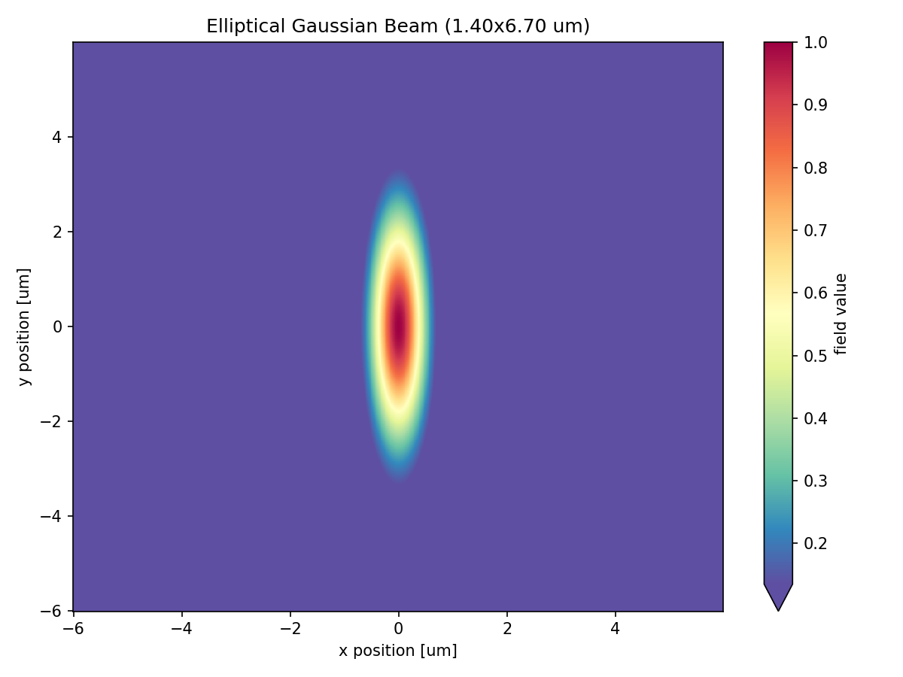
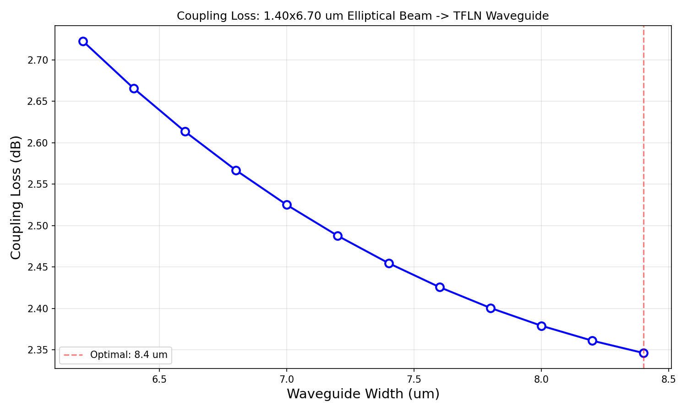
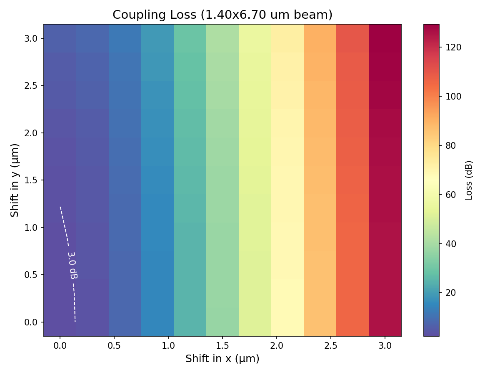
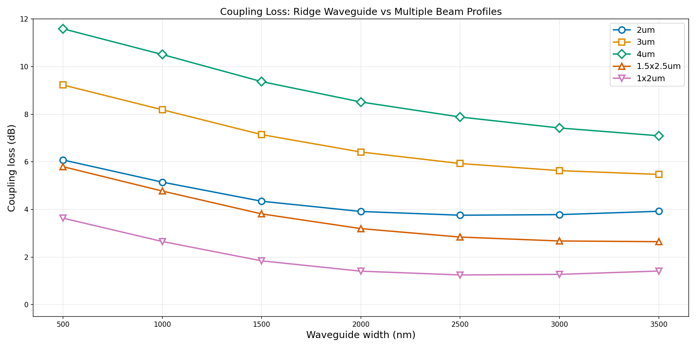

# PICbot - AI-Assisted Photonic Integrated Circuit Design Automation

An open-source toolkit for automating repetitive PIC (Photonic Integrated Circuit) design tasks, starting with thin-film lithium tantalate (TFLT / LiTaO3) waveguides at 780 nm. Built on top of [Tidy3D](https://www.flexcompute.com/tidy3d/) electromagnetic solver.

> **Note:** This repository contains a **partial, open-source version** of the full PICbot platform. Proprietary material data, internal design libraries, and certain advanced modules are not included. The code here demonstrates the core calculation workflow and can be adapted for your own material platform.

## Example Results

### Example 1: Slab Waveguide — Elliptical Beam (1.40 x 6.70 um)

Slab waveguide (120 nm) coupled to an elliptical Gaussian beam. See [`results_exp/slab_elliptical_beam/analysis_report.md`](results_exp/slab_elliptical_beam/analysis_report.md) for the full report.

<p align="center">
  
  
</p>

| Metric | Value |
|--------|-------|
| Optimal slab width | 8.40 um |
| Coupling loss | 2.35 dB |
| Coupling efficiency | 58.3% |

<p align="center">
  
</p>

### Example 2: Ridge Waveguide — Multi-Beam Comparison

Ridge waveguide (300 nm ridge + 120 nm slab) compared across 5 beam profiles. See [`results_exp/ridge_multibeam/analysis_report.md`](results_exp/ridge_multibeam/analysis_report.md) for the full report.

<p align="center">
  
</p>

| Beam | Optimal Width | Loss (dB) | Efficiency |
|------|---------------|-----------|------------|
| 1x2um elliptical | 2.50 um | 1.25 | 75.0% |
| 1.5x2.5um elliptical | 3.50 um | 2.65 | 54.4% |
| 2um circular | 2.50 um | 3.76 | 42.1% |

## Motivation

PIC design involves many standardized but time-consuming calculations: single-mode width sweeps, mode overlap with fibers/SOAs/BOAs, component optimization, and PDK generation. **PICbot** aims to automate this entire workflow so designers can focus on system architecture and creative design, not repetitive simulations.

When switching material platforms (e.g., Si -> SiN -> TFLN), only the material parameters need to change -- the entire calculation pipeline runs automatically.

## Project Status

### Done

| Phase | Task | Status | Module |
|-------|------|--------|--------|
| **1. Material Definition** | LiTaO3 dispersion model (ne, no) from CSV | Done | `func.py` |
| | SiO2 cladding dispersion | Done | `func.py` |
| | SiN dispersion (n, k) | Done | `func.py` |
| | Anisotropic medium for Tidy3D | Done | `mode_overlap_calculator.py` |
| **2. Waveguide Basics** | Mode solver setup (ridge & slab) | Done | `mode_overlap_calculator.py` |
| | Waveguide width sweep (batch on cloud) | Done | `mode_overlap_calculator.py` |
| **3. Mode Overlap** | Gaussian beam generation (circular & elliptical) | Done | `mode_overlap_calculator.py` |
| | Mode overlap integral calculation | Done | `mode_overlap_calculator.py` |
| | Coupling efficiency vs waveguide width scan | Done | `mode_overlap_calculator.py` |
| | Alignment tolerance 2D map | Done | `mode_overlap_calculator.py` |
| | Visualization & auto-report generation | Done | `run_elliptical_beam_analysis_v2_0127.py` |

### Planned

| Phase | Task | Priority |
|-------|------|----------|
| **2. Waveguide Basics** | Single-mode condition analysis (neff vs width, mode area vs width) | High |
| | AI-assisted design point recommendation (critical width + 10-30% margin) | High |
| | Waveguide spacing from 1e-7 intensity boundary | High |
| | Bend radius optimization (loss vs radius sweep) | High |
| **3. Components** | Directional coupler design & optimization | Medium |
| | Micro-ring resonator | Medium |
| | MMI (multimode interference) splitter | Medium |
| | Waveguide crossing | Medium |
| | Y-splitter | Medium |
| | Phase shifter (thermo-optic / EO) | Low |
| | Modulator | Low |
| **4. PDK Generation** | Component compiler (rigid & parameterized) | Low |
| | PDK code generation | Low |
| | Test structure layout | Low |
| | GDSII export | Low |

## Installation

### 1. Clone the repository

```bash
git clone https://github.com/nano-code-2025/PDKAgent.git
cd PDKAgent
```

### 2. Create virtual environment & install dependencies

Requires **Python 3.10 - 3.13** (tidy3d does not yet support Python 3.14+).

```bash
python -m venv venv

# Windows
venv\Scripts\activate

# Linux / macOS
source venv/bin/activate

pip install -r requirements.txt
```

### 3. Configure API key

This project uses [Tidy3D](https://www.flexcompute.com/tidy3d/) cloud solver. Get a free API key at https://tidy3d.simulation.cloud/.

```bash
cp .env.example .env
# Edit .env and set your TIDY3D_API_KEY
```

### 4. Prepare material data

Material dispersion CSV files are **not included** in this repo (proprietary measurement data). You need to provide your own under `material/`:

| File | Format | Description |
|------|--------|-------------|
| `LiTaO3 300 nm ellipsometer data.csv` | `wavelength,ne,no` (nm) | LiTaO3 ordinary & extraordinary indices |
| `SiO2 Malitson 1965.csv` | `wl,n` (um) | SiO2 cladding index |
| `LPCVD_SiN_385nm.csv` | `wl,n,k` (um) | SiN index & extinction |

You can use published Sellmeier data or your own ellipsometry measurements.

## Quick Start

```python
from mode_overlap_calculator import ModeOverlapCalculator, WaveguideConfig, GaussianBeamConfig, ScanConfig

# Initialize with dispersive LiTaO3 at 780 nm
calc = ModeOverlapCalculator(wavelength=0.78)
calc.configure_api()  # reads TIDY3D_API_KEY from .env

# Create elliptical Gaussian beam (fiber spot)
beam_config = GaussianBeamConfig(waist_radius_x=0.7, waist_radius_y=3.35)
beam = calc.create_gaussian_beam(beam_config)

# Define waveguide
wg_config = WaveguideConfig(
    thickness=0.30,        # ridge height (um)
    width=0.5,             # waveguide width (um)
    slab_thickness=0.12,   # slab thickness (um)
    waveguide_type="ridge",
)

# Solve mode and compute coupling
mode_data = calc.solve_waveguide_mode(wg_config)
loss_db = calc.compute_coupling_loss_db(mode_data, beam)
print(f"Coupling loss: {loss_db:.2f} dB")
```

See `example_mode_overlap_analysis.py` for more examples.

## Project Structure

```
PICbot/
├── mode_overlap_calculator.py        # Core calculator: mode solver, overlap, scans
├── func.py                           # Material dispersion models (LiTaO3, SiO2, SiN)
├── example_mode_overlap_analysis.py  # Usage examples
├── run_elliptical_beam_analysis_v2_0127.py  # Slab waveguide analysis + report
├── run_ridge_multibeam_analysis.py   # Ridge waveguide multi-beam analysis + report
├── results_exp/                      # Example outputs
│   ├── slab_elliptical_beam/         #   Slab waveguide coupling report
│   └── ridge_multibeam/              #   Ridge waveguide multi-beam report
├── doc/                              # Design workflow documentation
├── material/                         # Material CSV data (not tracked)
├── requirements.txt
├── .env.example                      # API key template
└── README.md
```

## Design Workflow

The full PIC design automation workflow follows four phases:

```
Phase 1: Material & Process       Phase 2: Waveguide Design
+---------------------+           +--------------------------+
| Material index (CSV) |--------->| Single-mode width sweep  |
| Process parameters   |          | Mode area analysis       |
| Working wavelength   |          | WG spacing (1e-7 bound.) |
+---------------------+          | Bend radius optimization |
                                  +------------+-------------+
                                               |
Phase 3: Components                            v
+--------------------------+      +--------------------------+
| Mode overlap (fiber/SOA) |<-----| Design parameters        |
| Coupler, Ring, MMI       |      +--------------------------+
| Crossing, Splitter       |
| Phase shifter, Modulator |
+------------+-------------+
             |
Phase 4: PDK & Layout             v
+--------------------------+
| Component compiler       |
| PDK code generation      |
| Test structure layout    |
| GDSII export             |
+--------------------------+
```

## Default Platform Parameters

| Parameter | Value |
|-----------|-------|
| Material | Thin-film LiTaO3 |
| Ridge height | 300 nm |
| Slab thickness | 120 nm |
| Etch angle | 20 deg |
| Cladding | SiO2 |
| Wavelength | 780 nm |

## Disclaimer

This is a **partial open-source release** for demonstration purposes. The full platform includes additional proprietary modules (advanced component libraries, internal PDK generators, and measured material databases) that are not published here. The open-source portion is sufficient to reproduce the core mode overlap workflow and can be extended for other material platforms.

## Contributing

Contributions are welcome! Especially for:
- Additional material models
- New component calculators (Phase 3)
- PDK generation (Phase 4)
- Documentation and tutorials

## License

MIT

## Acknowledgments

- [Tidy3D](https://www.flexcompute.com/tidy3d/) by Flexcompute for the electromagnetic solver
- Refractive index data from ellipsometry measurements and published literature
