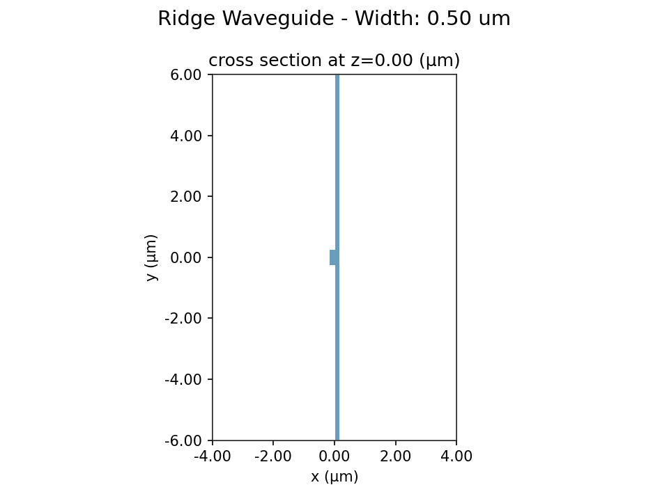
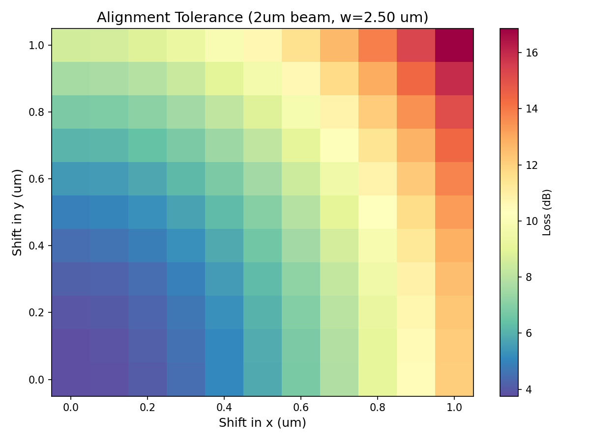
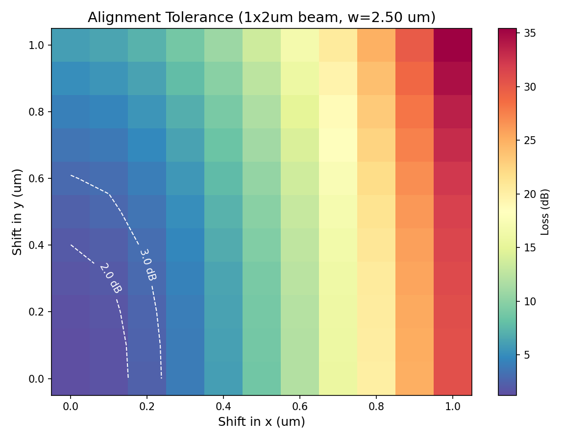

# Ridge Waveguide Multi-Beam Coupling Report

**Generated:** 2026-03-15 21:29:28

## 1. Configuration

| Parameter | Value |
|-----------|-------|
| Wavelength | 780 nm |
| Material | LiTaO3 |
| n_ordinary | 2.172734 |
| n_extraordinary | 2.175714 |
| n_cladding | 1.453673 |
| Waveguide type | ridge |
| Ridge thickness | 300 nm |
| Slab thickness | 120 nm |
| Width scan | 0.5 - 4.0 um, step 0.5 um |

### Beam Profiles

| Beam | Diameter X (um) | Diameter Y (um) | Type |
|------|-----------------|-----------------|------|
| 2um | 2.0 | 2.0 | Circular |
| 3um | 3.0 | 3.0 | Circular |
| 4um | 4.0 | 4.0 | Circular |
| 1.5x2.5um | 1.5 | 2.5 | Elliptical |
| 1x2um | 1.0 | 2.0 | Elliptical |

## 2. Waveguide Cross Section

## 3. Coupling Results

| Width (um) | 2um (dB) | 3um (dB) | 4um (dB) | 1.5x2.5um (dB) | 1x2um (dB) |
|------------|------------|------------|------------|------------|------------|
| 0.50 | 6.08 | 9.23 | 11.59 | 5.80 | 3.63 |
| 1.00 | 5.15 | 8.19 | 10.51 | 4.77 | 2.65 |
| 1.50 | 4.35 | 7.14 | 9.37 | 3.81 | 1.84 |
| 2.00 | 3.91 | 6.41 | 8.51 | 3.19 | 1.41 |
| 2.50 | 3.76 | 5.93 | 7.88 | 2.84 | 1.25 |
| 3.00 | 3.78 | 5.63 | 7.42 | 2.68 | 1.27 |
| 3.50 | 3.92 | 5.47 | 7.10 | 2.65 | 1.41 |

### Optimal Design Points

| Beam | Optimal Width (um) | Loss (dB) | Efficiency (%) |
|------|--------------------|-----------|----------------|
| 2um | 2.50 | 3.76 | 42.1 |
| 3um | 3.50 | 5.47 | 28.4 |
| 4um | 3.50 | 7.10 | 19.5 |
| 1.5x2.5um | 3.50 | 2.65 | 54.4 |
| 1x2um | 2.50 | 1.25 | 75.0 |

## 4. Alignment Tolerance (w = 2.50 um)

### 2um beam

### 1x2um beam

