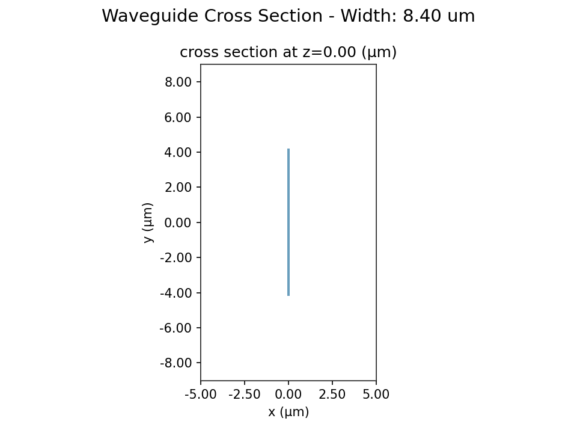

# Mode Overlap Analysis Report

**Generated:** 2026-03-15 20:51:56

## 1. Configuration

| Parameter | Value |
|-----------|-------|
| Wavelength | 780 nm |
| Material | LiTaO3 |
| n_ordinary | 2.172734 |
| n_extraordinary | 2.175714 |
| n_cladding | 1.453673 |
| Waveguide type | slab |
| Thickness | 120 nm |
| Slab thickness | 120 nm |
| Beam diameter | 1.40 x 6.70 um (elliptical) |
| Width scan | 6.2 - 8.6 um, step 0.2 um |
| Simulation domain | 10.0 x 18.0 um |
| Grid resolution | 35 steps/wavelength |

## 2. Gaussian Beam Profile

## 3. Coupling Results

| Width (um) | Loss (dB) | Efficiency (%) |
|------------|-----------|----------------|
| 6.20 | 2.72 | 53.43 |
| 6.40 | 2.67 | 54.13 |
| 6.60 | 2.61 | 54.78 |
| 6.80 | 2.57 | 55.38 |
| 7.00 | 2.52 | 55.91 |
| 7.20 | 2.49 | 56.40 |
| 7.40 | 2.45 | 56.83 |
| 7.60 | 2.43 | 57.21 |
| 7.80 | 2.40 | 57.54 |
| 8.00 | 2.38 | 57.82 |
| 8.20 | 2.36 | 58.06 |
| 8.40 | 2.35 | 58.26 **optimal** |

### Optimal Design Point

| Metric | Value |
|--------|-------|
| Optimal width | 8.40 um |
| Coupling loss | 2.35 dB |
| Coupling efficiency | 58.3% |

## 4. Alignment Tolerance

## Appendix: Waveguide Cross Sections

